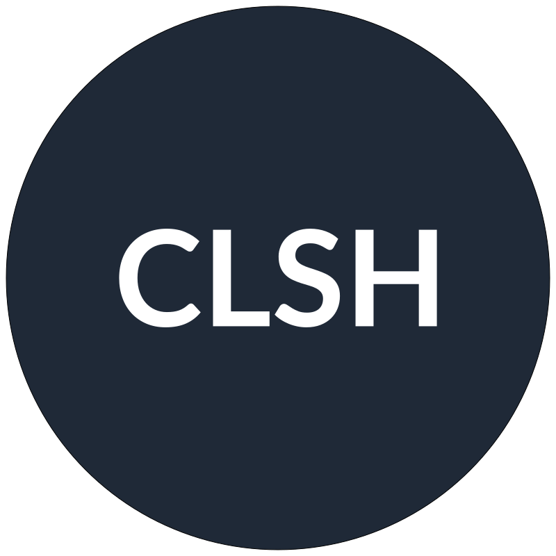

<div id="top"></div>

<br />
<div align="center">
  <a href="https://github.com/skryvvara/clsh">
      
  </a>

  <h3 align="center">CLSH - A <a href="http://lua.org" target="_BLANK">Lua</a> scripting host written in C</h3>
</div>

## Description

> ! This is a very early proof of concept

CLSH is a [Lua](https://lua.org) scripting host written in C.

## Build

You can build clsh using cmake, first verify that cmake and a c++ compiler is installed.
The Lua sources are included in the lib/lua directory, therefore no external packages or an internet connection is required.

```sh
cmake --version

#cmake version 3.30.0
#
#CMake suite maintained and supported by Kitware (kitware.com/cmake).

clang --version

#Apple clang version 15.0.0 (clang-1500.3.9.4)
#Target: arm64-apple-darwin23.5.0
#Thread model: posix
#InstalledDir: /Applications/Xcode.app/Contents/Developer/Toolchains/XcodeDefault.xctoolchain/usr/bin
```

now run the steps below to compile and run the code

```sh
mkdir build
cd build

cmake ..
make

./clsh
# usage: ./clsh [file]
```

## Usage

Currently the only supported usage is by providing a lua file as the first argument to CLSH.

Example:
```sh
./clsh

./clsh
# usage: ./clsh [file]

./clsh ../scripts/test.lua
# Hi from test.lua
```

Alternatively you can use the shebang notation to run the lua scripts directly, to do this some preperation
is necessary.

1. Copy the clsh binary to a directory in your path
```sh
echo $PATH
cp ./clsh /dir/in/path/clsh

# example:
# I have a directory called $HOME/bin containing the clsh binary

mkdir ~/bin
echo "export PATH=$PATH:$HOME/bin >> .zshrc
cp ./clsh $HOME/bin/clsh
```
2. Now create a lua script with the shebang line. You can find an example under scripts/shebang.lua
```lua
#!/usr/bin/env clsh

-- test.lua
print("Hi from shebang.lua")
```
3. Check the permissions for the lua script, if you are using this method the script itself has to be executable
```sh
chmod +x ./scripts/shebang.lua
./scripts/shebang.lua
# Hi from shebang.lua
```
4. (optional) copy the script to a location within your path
```sh
cp shebang.lua $HOME/bin/shebang

shebang
# Hi from shebang.lua
```

## License

CLSH is licensed under the [MIT License](https://opensource.org/license/mit).

---

<div align="center">
  <a href="https://lua.org">
      
  </a>
</div>
